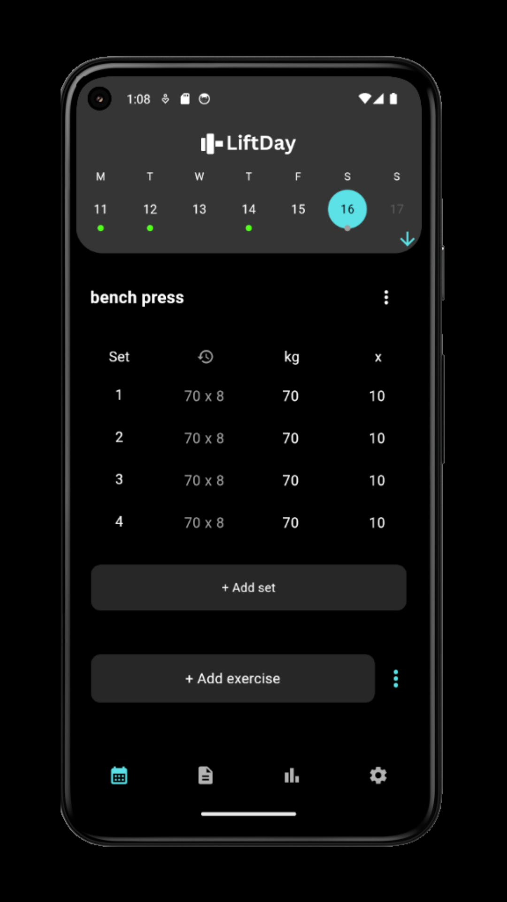
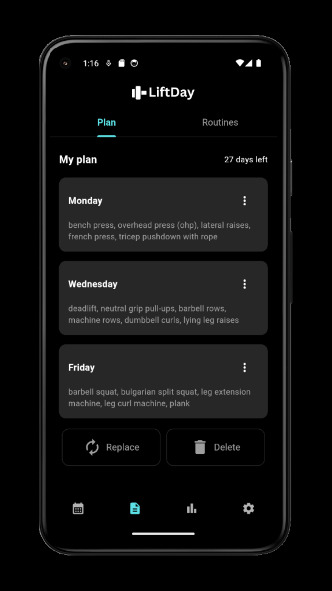
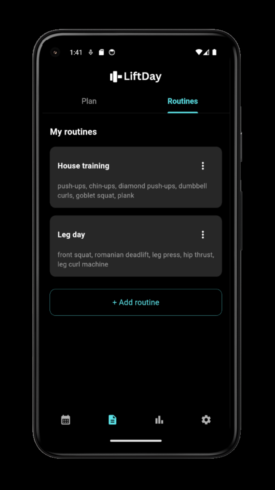
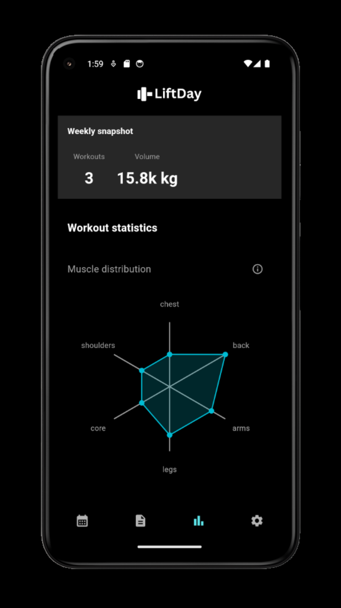
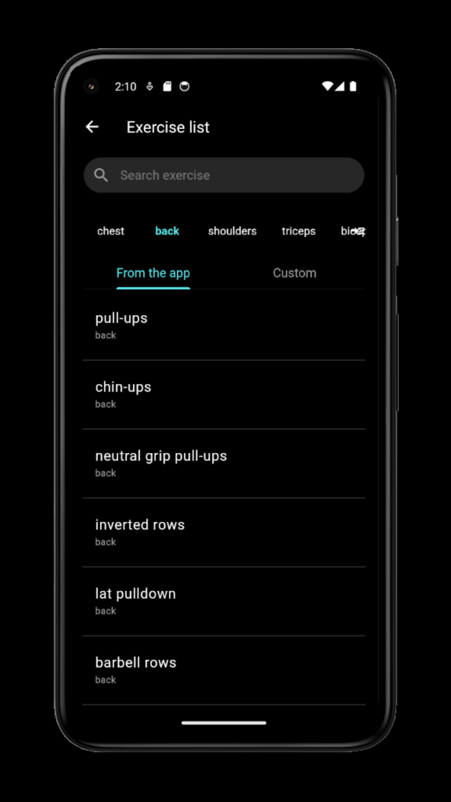
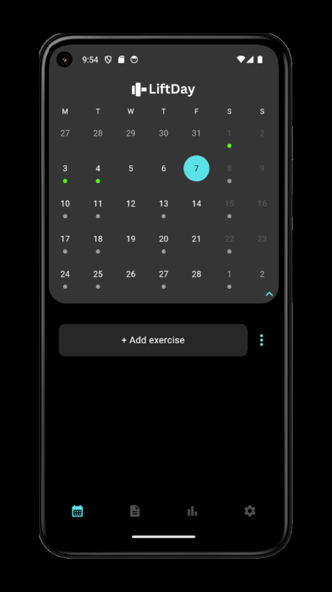

This README refers to version 1.0.5

# LiftDay - Gym Workout Tracker 🦾

A cross-platform mobile application designed to help users effortlessly track their workouts. The user interface is simple and intuitive, functioning like a calendar for easy workout logging and progress tracking.

---

## 🛠 **Technologies Used**

- Dart
- Flutter
- SQFlite
- BLoC
- Provider
- FL Chart

---

## **Main features organized by app tabs**

### 📅 **Calendar Panel**  
- Log exercises with sets 
- Add custom exercises or choose from a predefined exercise list  
- View the history of previous training sessions  
- Automate the calendar with a workout plan  
- Load workout routines 
- Generate training reports  

### 📋 **Plan Panel**  
- Create and edit workout plans
- Design and manage custom workout routines

### 📊 **Statistics Panel**  
- View a snapshot of the current week
- Analyze muscle group distribution over a selected period
- Track weight lifted over time 

### ⚙️ **Settings**  
- Toggle between dark and light mode  
- Choose measurement units: kg/lbs  
- Create and restore app data backups

---

## 📸 **Screenshots**

  
  
  

  
  
  

---

